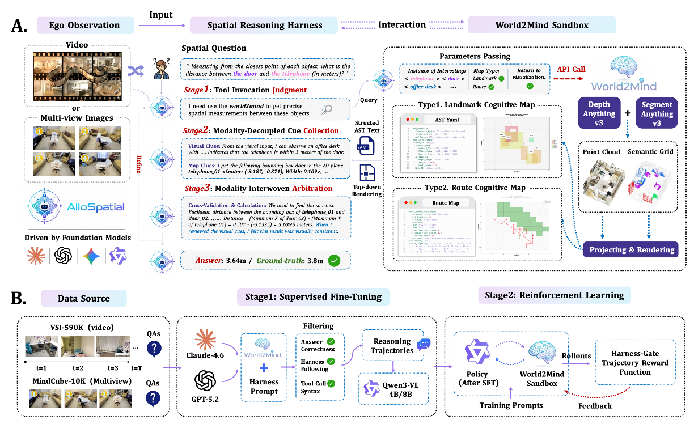

# AlloSpatial: An Agentic Harness Framework for Spatial Reasoning in Foundation Models

<p align="center">
  Shouwei Ruan<sup>1</sup>, Bin Wang<sup>2</sup>, Zhenyu Wu<sup>1</sup>, Qihui Zhu<sup>1</sup>, Yuxiang Zhang<sup>2</sup>, Hang Su<sup>3</sup>, Yubin Wang<sup>2&#42;</sup>
</p>

<p align="center">
  <sup>1</sup> Institute of Artificial Intelligence, Beihang University &nbsp;•&nbsp;
  <sup>2</sup> Huawei Noah&#39;s Ark Lab <br>
  <sup>3</sup> Dept. of Comp. Sci. and Tech., Institute for AI, Tsinghua-Bosch Joint ML Center, THBI Lab, BNRist Center, Tsinghua University <br>
  <sup>&#42;</sup> project leader
</p>

<p align="center">
  <a href="https://arxiv.org/abs/2603.09774"></a>
  <a href="#"></a>
  <a href="#"></a>
  <a href="#"></a>
</p>

AlloSpatial equips multimodal foundation models with **allocentric spatial reasoning**. It converts
egocentric video / multi-view images into structured spatial priors with **World2Mind** (a
cognitive-mapping sandbox), and reasons over them through a **Spatial Reasoning Harness** that decides
when to call the tool, collects evidence, and cross-validates geometry against semantics before
answering. The harness works training-free for proprietary models and is internalized into open-weight
models (Qwen3-VL) via SFT cold-start + GRPO reinforcement learning.

## 📰 News

- 🎉 **2026.06** — We open-sourced **World2Mind** along with the **AlloSpatial** training and inference
  scripts. Model weights and training datasets will be released in the near future.
- 📝 **2026.05** — **AlloSpatial** is under review.
- 🏆 **2026.04** — An early version of our work, *World2Mind: Cognition Toolkit for Allocentric Spatial
  Reasoning in Foundation Models* ([arXiv:2603.09774](https://arxiv.org/abs/2603.09774)), was accepted
  to the **CVPR ViSCALE Workshop**.

## 📦 What's included

| Component | Released |
|---|---|
| **World2Mind** — cognitive-mapping sandbox (Depth Anything 3 + SAM 3 → AST + route map), HTTP service | ✅ |
| **Inference** — World2Mind + commercial APIs and open-source / trained models; benchmark scripts | ✅ |
| **SFT** — cold-start training scripts (ms-swift) | ✅ |
| **RL** — GRPO training scripts, reward / scheduler plugins, ms-swift patch | ✅ |
| **Evaluation** — vendored `lmms-eval` with World2Mind / blind / api-baseline adapters | ✅ |
| **Training datasets** (SFT trajectories, GRPO prompts) | 🚧 |
| **Model weights** (trained AlloSpatial checkpoints) | 🚧 |

## 🗂️ Repository layout

```
AlloSpatial/
├── world2mind/     # cognitive-mapping sandbox (DA3 + SAM3 → point cloud → AST + route map), served over HTTP
├── inference/      # World2Mind + models: commercial APIs (demo_openai) and open-source / trained models (demo_vllm)
├── training/       # SFT (cold start) + GRPO RL: scripts, reward/scheduler plugins, ms-swift patch
├── lmms-eval/      # evaluation framework (vendored) with the World2Mind / blind / api-baseline models
└── requirements.txt
```

## 🧩 Framework

<p align="center">
  
</p>

<p align="center">
  <b>(A)</b> At inference time, AlloSpatial follows a three-stage Spatial Reasoning Harness —
  tool-invocation judgment, modality-decoupled cue collection, and geometry–semantics arbitration — to
  invoke World2Mind, acquire allocentric spatial knowledge, and arbitrate evidence before answering.
  <b>(B)</b> To internalize the harness, high-quality harness-following trajectories are distilled from
  proprietary models for supervised cold start, then the policy is optimized with live World2Mind
  interaction and a Harness-Gated Trajectory Reward.
</p>

```
                         ┌──────────────────────────────────────────┐
  video / images  ─────► │  World2Mind service (FastAPI, GPU)        │
                         │  DA3 depth + pose  →  SAM 3 segmentation   │
                         │  → semantic point cloud → AST + route map  │
                         └───────────────▲───────────────┬──────────┘
                                         │  HTTP          │  AST (YAML) + renders
                  tool call (world2mind, │                ▼
                  view_image)            │     ┌──────────────────────────┐
                                         └─────┤  Foundation model (agent) │
                                               │  Spatial Reasoning Harness │
                                               │  Judge→Collect→Arbitrate   │
                                               └──────────────┬─────────────┘
                                                              ▼  <Answer> … </Answer>
```

The model service is loaded once and reused; the agent (a proprietary API model, a local vLLM/swift
server, or a trained AlloSpatial checkpoint) calls it over HTTP during reasoning.

## ⚙️ Installation

```bash
git clone <this-repo> AlloSpatial && cd AlloSpatial

# 1. Core tool dependencies
pip install -r requirements.txt

# 2. Perception models
#    - Depth Anything 3:  pip install "git+https://github.com/ByteDance-Seed/Depth-Anything-3.git"
#    - SAM 3:             install the SAM 3 package and download sam3.pt
#    Then point world2mind/config/default_config.yaml at the weights (da3.model, sam3.model_path).

# 3. Evaluation (vendored lmms-eval)
pip install -e lmms-eval

# 4. Training only: install ms-swift and apply the GRPO patch (see training/patches/README.md)

# Tell the eval models / demos where the tool package lives:
export WORLD2MIND_ROOT="$PWD/world2mind"
```

## 🚀 Quickstart

### 1. Start the World2Mind service

```bash
cd world2mind
# edit config/default_config.yaml: da3.model, sam3.model_path, gpu_ids
python start_service.py --gpu_ids 0 --port 8100
curl http://localhost:8100/health
```

### 2. World2Mind + a commercial model (training-free)

```bash
export OPENAI_API_KEY=...            # and optionally OPENAI_BASE_URL
python inference/demo_openai.py --video /path/to/video.mp4 \
    --query "How many chairs are in the room?" --model gpt-5.2
```

### 3. World2Mind + an open-source / trained model

```bash
# serve a local model (vLLM or swift) — e.g. a trained AlloSpatial checkpoint
MODEL=/path/to/AlloSpatial-checkpoint bash inference/start_server.sh --port 8003
python inference/demo_vllm.py --video /path/to/video.mp4 \
    --query "Describe the spatial layout" --server-url http://localhost:8003/v1
```

### 4. Benchmark evaluation (VSI-Bench / MindCube)

```bash
# proprietary model + World2Mind (uses the lmms-eval `world2mind` model)
bash inference/run_benchmark.sh --tasks vsibench_tiny --model gpt-5.2
# local / trained model + World2Mind (uses `world2mind_local`)
bash inference/run_local_benchmark.sh --tasks mindcube_tiny
```

See `world2mind/README.md` and `inference/README.md` for full options.

## 🏋️ Training

AlloSpatial internalizes the Spatial Reasoning Harness into Qwen3-VL in two stages, both built on
[ms-swift](https://github.com/modelscope/ms-swift):

1. **SFT cold-start** (`training/sft/`) — supervised fine-tuning on harness-following trajectories so
   the model learns the tool-call syntax, the Step1–5 reasoning structure, AST/route parsing, and the
   `<Answer>` format.
2. **GRPO RL** (`training/rl/`) — Group Relative/Sequence Policy Optimization with **live World2Mind
   tool calling during rollout** and a **Harness-Gated Trajectory Reward** (structure + accuracy +
   tool-use + length).

> The training datasets (distilled SFT trajectories and GRPO prompts) and the trained model weights are
> **not yet released**. The scripts below expect dataset paths you provide; data sources are VSI-590K and
> the MindCube training set.

### Stage 1 — SFT

```bash
cd training/sft
BASE_MODEL=Qwen/Qwen3-VL-8B-Instruct \
SFT_DATASET=/path/to/sft_swift.jsonl \
OUTPUT_DIR=./output/AlloSpatial-sft-8B \
bash qwen3-vl.sh
```

The SFT dataset is an ms-swift *messages*-format JSONL: each line is
`{"messages": [{"role": "system"|"user"|"assistant", "content": ...}], ...}` with multimodal
(video/image) content and assistant turns containing the Step1–5 reasoning, `<tool_call>` blocks, and
the final `<Answer>…</Answer>`.

### Stage 2 — GRPO RL

GRPO runs three cooperating services (typical 8-GPU layout):

```
GPU 0,1   World2Mind tool service (DA3 + SAM3)   → training/rl/start_world2mind.sh (or _mp.sh for a fleet)
GPU 2,3   vLLM rollout server (model generation) → training/rl/start_vllm_rollout.sh
GPU 4-7   GRPO trainer (ms-swift, ZeRO2)         → training/rl/grpo_qwen3vl_v3.sh  (8B: grpo_qwen3vl_v3-8B.sh)
```

```bash
cd training/rl
python build_grpo_dataset.py          # build the prompt set (VSI-590K + MindCube)
python build_val_dataset.py           # build the VSI-Bench tiny + MindCube tiny val set

# three terminals:
bash start_world2mind.sh              # or: bash start_world2mind_mp.sh
bash start_vllm_rollout.sh
SFT_CHECKPOINT=/path/to/AlloSpatial-sft-4B/checkpoint OUTPUT_DIR=./output/AlloSpatial-grpo-4B \
  bash grpo_qwen3vl_v3.sh
```

**Reward functions (Harness-Gated Trajectory Reward).** Default weights
`[structure, accuracy, tool_use, length] = [0.15, 0.60, 0.10, 0.15]`. HGTR scores the whole trajectory
and applies two gates: accuracy is **structure-gated** (credited only when the trajectory follows the
harness format), and the tool reward is **correctness-tied** (granted only when a valid tool call
contributes to a correct answer). See `training/README.md` and `training/rl/README.md` for the full
reward, curriculum / adaptive-weight, in-training-evaluation, and env-var reference, and
`training/patches/README.md` for the required ms-swift patch.

## 🙏 Acknowledgements

Built on [Depth Anything 3](https://github.com/ByteDance-Seed/Depth-Anything-3), [SAM 3](http://github.com/facebookresearch/sam3),
[ms-swift](https://github.com/modelscope/ms-swift), and
[lmms-eval](https://github.com/EvolvingLMMs-Lab/lmms-eval). Evaluated on
[VSI-Bench](https://huggingface.co/datasets/nyu-visionx/VSI-Bench) and [MindCube](https://huggingface.co/datasets/MLL-Lab/MindCube). Thanks for these excellent works!

## 📑 Citation

```bibtex
@article{ruan2026world2mind,
  title={World2Mind: Cognition Toolkit for Allocentric Spatial Reasoning in Foundation Models},
  author={Ruan, Shouwei and Wang, Bin and Wu, Zhenyu and Zhu, Qihui and Zhang, Yuxiang and Su, Hang and Wang, Yubin},
  journal={arXiv preprint arXiv:2603.09774},
  year={2026}
}
```
